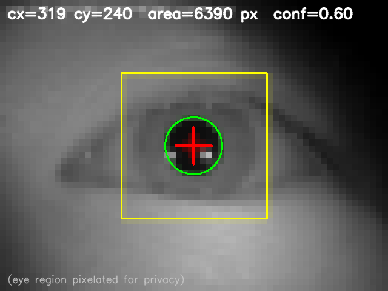

# PupilCenter_N6

STM32N6570-DK 기반 **실시간 동공 중심 좌표 검출** 프로젝트.
AI 없이 classical CV (임계화 + flood-fill + centroid) 만으로 IR 눈 이미지에서
동공 중심을 안정적으로 찾고, UART 로 실시간 송출한다.

> 목표: 카메라가 잡은 동공 좌표를 외부 모터 제어기에 전달해 XY 스테이지를
> 눈 앞으로 자동 정렬(오토얼라인) 시키는 광학기기의 비전 파트.



*ROI(노란 사각형) 안에서 flood-fill 로 동공 blob 을 찾아 중심(빨간 십자)
과 추정 반지름(초록 원) 을 계산한 PC 시뮬레이터 결과 예시.
눈 영역은 개인정보 보호를 위해 픽셀화한 상태.*

---

## 주요 특징

- **AI 없음** — NPU / 모델 로딩 없이 Cortex-M55 만으로 30 FPS 수준
- **Bare-metal 파이프라인** — HAL 최소화, `Core/` 아래 모든 로직은
  PC 에서도 그대로 빌드 가능하도록 하드웨어 독립 설계
- **PC 시뮬레이터 동봉** — 펌웨어와 동일한 C 코드를 DLL 로 빌드하고
  Python + OpenCV 로 이미지 셋에 일괄 적용해 파라미터 튜닝
- **보드 + 시뮬레이터 일치 보장** — 같은 `pupil_detect.c` 가 양쪽에서 돈다

---

## 시스템 개요

```
                    +----------------------+
  Camera (RGB565)   |  DCMIPP PIPE1        |
  ------>  PSRAM    |  (HW-accelerated)    |
                    +----------+-----------+
                               |
                               v
               +----------------------------+
               |  camera_if   -> frame_mgr  |   single-slot handoff
               +----------------------------+
                               |
                               v
               +----------------------------+
               |  tracking_sm   ->  roi_mgr |   SEARCH / TRACK / RECOVERY
               +----------------------------+
                               |
                               v
               +----------------------------+
               |  pupil_detect              |
               |   1) G-channel threshold   |
               |   2) 4-conn flood-fill CC  |
               |   3) area x center score   |
               |   4) integer centroid      |
               +-------------+--------------+
                             |
                +------------+-------------+
                v                          v
       +----------------+        +------------------+
       |  pupil_filter  |        |  debug_overlay   |
       |  EMA + jump    |        |  in-place cross  |
       +----------+-----+        +--------+---------+
                  |                       |
                  v                       v
          +---------------+       +-----------------+
          | result_output |       |    LCD (LTDC)   |
          | UART 115200   |       |  layer-0 direct |
          +---------------+       +-----------------+
```

펌웨어 구조는 `Application/STM32N6570-DK/Core/` 아래 9개 모듈로 잘려 있고,
모든 모듈은 하드웨어 독립이라 **PC 에서도 그대로 컴파일된다**.

---

## 디렉터리 구조

```
PupilCenter_N6/
|- Application/
|  |- STM32N6570-DK/
|     |- Core/
|     |  |- Inc/             # pupil_config.h / app_types.h / ...
|     |  |- Src/             # pupil_detect / roi_mgr / tracking_sm / ...
|     |- Src/                # bsp_uart.c / bsp_lcd.c / main.c
|     |- Inc/                # ST reference headers (keep as-is)
|     |- STM32CubeIDE/       # IDE project (.project / .cproject / .ld)
|
|- sim/                      # PC simulator (ctypes + OpenCV)
|  |- sim_api.c              # DLL entry point
|  |- build_dll.bat          # MinGW gcc build script
|  |- sim.py                 # Python runner
|  |- montage.py             # result grid
|  |- make_unaligned.py      # synthetic off-centre dataset
|  |- bench_search.py        # SEARCH strategy benchmark
|
|- .gitignore
|- LICENSE
|- README.md (you are here)
```

> **제외**: ST Cube FW / Middlewares / Drivers / Utilities. 용량 문제로
> repo 에 포함하지 않았다. 아래 **보드 빌드** 절에서 SDK 받아 배치.

---

## 보드 빌드 & 실행

### 필요 도구
- **STM32CubeIDE 1.14+** (gcc 14.x 번들)
- **STM32CubeProgrammer 2.15+**
- **STM32N6 Cube FW** (5.x, 별도 다운로드)
- **ST-LINK 드라이버 (STSW-LINK009)**

### 준비
1. STM32CubeN6 FW 를 `STM32Cube_FW_N6/` 에 배치
   (`.project` 가 linked resource 로 참조하므로 경로 중요)
2. CubeIDE 에서 `File -> Import -> Existing Projects into Workspace`
   로 `Application/STM32N6570-DK/STM32CubeIDE` 선택
3. `Build Project` (0 errors 기대)

### 플래시 (Dev Mode 로 바로 실행)
STM32N6 는 외부 XSPI NOR 에서 부팅하므로, 최초 sanity check 에는
FSBL + 서명 과정을 생략하고 CubeIDE 의 **Debug As** 를 사용하는 게 빠르다.

1. 보드 BOOT 스위치를 **Dev Mode** 로
2. `PupilCenter_N6` 프로젝트 우클릭 -> **Debug As -> STM32 C/C++ Application**
3. 디버거가 코드를 로드하면 **Resume (F8)**

### UART 확인
- 포트: USART1 (ST-LINK Virtual COM Port)
- **115200 / 8-N-1 / flow control: None**
- 부팅 로그 예시:
  ```
  PupilCenter_N6 - classical CV skeleton
  Build: ...
  boot: preview=480x480 stride=960 ROI_search=256x256 ROI_track=240x240
  F=1,T=1071,CX=239.00,CY=239.00,CONF=0.73,VALID=1,STATE=0,LAT=0
  ...
  ```
- 출력 포맷: `F=프레임번호, T=ms, CX/CY=full-frame 픽셀, CONF=0..1, VALID, STATE, LAT=us`

---

## PC 시뮬레이터

펌웨어에 넣기 전에 파라미터를 PC 에서 빠르게 튠하기 위한 도구.
`Core/Src/pupil_detect.c` 를 Windows DLL 로 빌드하고 Python 에서 호출한다.

### 필요 도구
- Python 3.10+, `opencv-python`, `numpy`
- MinGW-w64 gcc (Windows)

### DLL 빌드
```bash
cd sim
build_dll.bat
```

`sim/pupil_detect.dll` 이 생성된다.

### 이미지 한 장 테스트
```bash
python sim.py path/to/eye.png --thr 60 --min 500 --max 30000 --roi 200,120,240,240
```

### 폴더 일괄 처리 + 몽타주
```bash
python sim.py path/to/ir_images/ --thr 60 --min 500 --max 30000 --roi 200,120,240,240
python montage.py
```

결과:
- `sim/out/*_det.png` — 각 이미지별 검출 오버레이
- `sim/out/results.csv` — 좌표 / 면적 / CONF 테이블
- `sim/out/montage.png` — 격자 뷰

### SEARCH 전략 벤치마크
동공이 프레임 구석에 있을 때 (정렬 전 상태) 도 찾아내는 전략을 비교.

```bash
python make_unaligned.py   # 원본을 shift 해 unaligned 셋 생성
python bench_search.py     # baseline vs tiled vs downsample
```

---

## 좌표계 규약

- 원점 = 프레임 **좌측 상단 (0, 0)**
- x: 좌 -> 우 증가
- y: **위 -> 아래** 증가 (OpenCV / DCMIPP / LTDC 공통)
- `pupil_result_t.cx / cy` 는 항상 full-frame 픽셀 좌표
- 모터 제어용 오프셋: `(cx - w/2, cy - h/2)`

---

## 알려진 제약

| 제약 | 영향 | 해결 방향 |
|---|---|---|
| `PUPIL_DETECT_MAX_ROI_W/H = 256` | ROI 가 256 을 넘으면 조기 리턴 | 큰 프레임은 타일 또는 downsample 로 쪼개서 훑기 |
| 각막반사광(glint) 이 flood-fill 구멍 | 동공이 여러 blob 으로 분리되어 중심 오차 | 시뮬레이터에서는 morph close 전처리로 해결, 보드 이식 TODO |
| IR 파라미터 != RGB 파라미터 | 카메라 방식 바뀌면 threshold / min_area 재튜닝 필수 | 설계 의도된 동작. PC 시뮬레이터로 반복 튜닝 |
| `LAT` 값이 간헐적으로 uint32 wrap | DWT CYCCNT 래핑 처리 미흡 | `perf_monitor` 정식화 TODO |

---

## 데이터셋 정책

이 repo 에는 **실험에 쓴 IR 눈 이미지가 포함되어 있지 않다**.
홍채는 생체정보에 해당하므로, 본인의 이미지를 쓰거나 공개 데이터셋
(CASIA, MMU, UBIRIS 등) 으로 시뮬레이터를 검증할 것.

시뮬레이터는 단일 채널 grayscale 입력을 가정한다.

---

## 로드맵

- [x] Phase 1: classical CV 파이프라인 보드 동작 검증
- [x] Phase 1.5: PC 시뮬레이터 구축 + IR 이미지 셋 튜닝
- [ ] Phase 2: morph close 의 C 이식
- [ ] Phase 3: 실제 IR 카메라 모듈 연결 및 실측
- [ ] Phase 4: 외부 모터 제어기와 UART 페어링 (오토얼라인 루프)
- [ ] Phase 5: 필요 시 AI refine 층 (YOLOX bbox / Iris landmark)

---

## 라이선스

MIT License — 자세한 내용은 [LICENSE](LICENSE) 참조.
ST Cube FW 관련 파일은 ST 자체 라이선스 적용.
